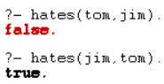
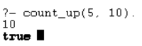
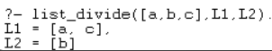

# practica 4

**Paradigma Logico**
```
Este paradigma se basa en los conceptos de lógica matemática, se basa en predicados que caracterizan o relacionan a los individuos involucrados y la deducción de las posibles respuestas a una determinada consulta.

Prolog es un lenguaje de programación que se enmarca en este paradigma.
```

# **Hechos**

_Los hechos en Prolog representan afirmaciones verdaderas sobre el mundo. Su sintaxis tiene características específicas:_

- El nombre de la relación (o predicado) siempre comienza con una letra minúscula.

- El nombre de la relación es el primer término en la estructura.

- Los objetos o términos (argumentos) se colocan entre paréntesis, separados por comas.

- Un hecho siempre termina con un punto (.).

- Los objetos pueden ser:

    - Átomos (palabras que comienzan con minúscula),

    - Números (pueden comenzar con dígitos),

    - O cadenas de caracteres entre comillas.

**Sintaxis de hechos (Ejemplos):**
```
- cat(tom). (Tom es un gato)
- loves_to_eat(jorge, pasta). (A Jorge le encanta comer pasta)
- of_color(hair, black). (Tiene el pelo negro)
- loves_to_play_games(paty). (A Paty le encanta jugar)
- lazy(juan). (Juan es perezoso)
```
```Guía para escribir hechos```
```
1.- Los nombres de propiedades/relaciones empiezan con minúsculas.
2.- El nombre de la relación aparece como primer término.
3.- Los objetos aparecen como argumentos separados por comas y entre paréntesis.
4.- Un punto "." debe terminar un hecho.
Los objetos también empiezan con minúsculas. También pueden empezar con
5.- dígitos (como 1234) y pueden ser cadenas de caracteres entre comillas, por ejemplo, color(penink, 'red').
6.- phoneno(agnibha, 1122334455). también se denomina predicado o cláusula.
```

**Consultas**

Consisten en interrogar para ver si un hecho es verdadero o falso
```
¿Es Tom un gato?
¿A Juan le encanta la pasta?
¿Está feliz Lili?
¿Irá Ryan a jugar?
```


```Base de conocimientos #1```


``` c++
girl(priya).
girl(natasha).
girl(jasmin).
can_cook(priya).
```


```Base de conocimientos #2```
``` c++
sing_a_song(ana).
listens_to_music(rodrigo).
listens_to_music(ana) :- sing_a_song(ana).
happy(ana) :- sing_a_song(ana).
happy(rodrigo) :- listens_to_music(rodrigo).
plays_guitar(rodrigo) :- listens_to_music(rodrigo).
```


```Base de conocimientos #3```
```c++
can_cook(priya).
can_cook(jasmin).
can_cook(timoteo).
likes(priya,jasmin) :- can_cook(jasmin).
likes(priya,timoteo) :- can_cook(timoteo).
```


# **Relaciones en Prolog**

En los programas Prolog, especifica la relación entre los objetos y las propiedades de
los objetos.

**_Tipos de relaciones:_**
```
Existen varios tipos de relaciones, algunas de las cuales también pueden ser reglas. Una regla puede determinar una relación incluso si esta no está definida explícitamente
como un hecho.

Podemos definir una relación fraternal, dos personas son hermanos sí:

- Los dos son varones.
- Tienen el mismo progenitor.
```

```Base de conocimientos #4```

```c++
parent(simon, pedro).
parent(simon, raj).
male(pedro).
male(raj).
brother(X,Y) :- parent(Z,X), parent(Z,Y), male(X), male(Y).
```


```Base de conocimientos #5```
```c++
female(pam). female(liz). female(pat). female(ann). male(jim). male(bob). male(tom). male(pete).
parent(pam,bob). parent(tom,bob). parent(tom,liz). parent(bob,ann). parent(bob,pat). parent(pat,jim). parent(pete,jim).

mother(X,Y):- parent(X,Y), female(X).
father(X,Y):- parent(X,Y), male(X).
haschild(X):- parent(X,_).
sister(X,Y):- parent(Z,X), parent(Z,Y), female(X), X \== Y.
brother(X,Y):- parent(Z,X), parent(Z,Y), male(X), X \== Y.

grandparent(X,Y):-parent(X,Z),parent(Z,Y).
grandmother(X,Z):-mother(X,Y),parent(Y,Z).
grandfather(X,Z):-father(X,Y),parent(Y,Z).
wife(X,Y):-parent(X,Z),parent(Y,Z),female(X),male(Y).
uncle(X,Z):-brother(X,Y),parent(Y,Z).
```


```Base de conocimientos #6```

#### **Recursion en relaciones familiares**
```
La recursión es una herramienta clave en Prolog para definir relaciones familiares que pueden extenderse a través de varios niveles, como la relación de antecesor o ancestro.
```

```c++
female(pam). female(liz). female(pat). female(ann). male(jim). male(bob). male(tom). male(pete).
parent(pam,bob). parent(tom,bob). parent(tom,liz). parent(bob,ann). parent(bob,pat). parent(pat,jim). parent(pete,jim).

mother(X,Y):- parent(X,Y), female(X).
father(X,Y):- parent(X,Y), male(X).
haschild(X):- parent(X,_).
sister(X,Y):- parent(Z,X), parent(Z,Y), female(X), X \== Y.
brother(X,Y):- parent(Z,X), parent(Z,Y), male(X), X \== Y.

grandparent(X,Y):-parent(X,Z),parent(Z,Y).
grandmother(X,Z):-mother(X,Y),parent(Y,Z).
grandfather(X,Z):-father(X,Y),parent(Y,Z).
wife(X,Y):-parent(X,Z),parent(Y,Z),female(X),male(Y).
uncle(X,Z):-brother(X,Y),parent(Y,Z).

grandparent(X,Y):-parent(X,Z),parent(Z,Y).
grandmother(X,Z):-mother(X,Y),parent(Y,Z).
grandfather(X,Z):-father(X,Y),parent(Y,Z).
wife(X,Y):-parent(X,Z),parent(Y,Z),female(X),male(Y).
uncle(X,Z):-brother(X,Y),parent(Y,Z).
```


### **Seguimiento de la salida**
```
En prolog podemos rastrear la ejecución. Para esto entramos al modo de rastreo con [trace] .
```

### **Recursion en las relaciones familiares (Continuacion)**
```Base de conocimientos #7```

```c++
female(pam). female(liz). female(pat). female(ann). male(jim). male(bob). male(tom). male(pete).
parent(pam,bob). parent(tom,bob). parent(tom,liz). parent(bob,ann). parent(bob,pat). parent(pat,jim). parent(pete,jim).

mother(X,Y):- parent(X,Y), female(X).
father(X,Y):- parent(X,Y), male(X).
haschild(X):- parent(X,_).
sister(X,Y):- parent(Z,X), parent(Z,Y), female(X), X \== Y.
brother(X,Y):- parent(Z,X), parent(Z,Y), male(X), X \== Y.

grandparent(X,Y):-parent(X,Z),parent(Z,Y).
grandmother(X,Z):-mother(X,Y),parent(Y,Z).
grandfather(X,Z):-father(X,Y),parent(Y,Z).
wife(X,Y):-parent(X,Z),parent(Y,Z),female(X),male(Y).
uncle(X,Z):-brother(X,Y),parent(Y,Z).

predecessor(X, Z) :- parent(X, Z).
predecessor(X, Z) :- parent(X, Y),predecessor(Y, Z).
```
### **Objetos de Datos**

```
Un objeto de datos es una unidad que agrupa información relacionada sobre algo en particular.
```
_Ejemplos:_

- Átomos − ```tom``` , ```pat``` , `x100` , `x_45`

- Cadenas especiales - `:-` , `=======>` , `...` , `.:.` , `::=`

- Cadenas de caracteres - `'Rubai'` , `'Hello, World!'`

- Números − `100`, `1235` , `2000.45`
- Variables − `X` , `Y` , `Xval` , `_X`

- Estructuras − `día(9, jun, 2017)` , `punto(10, 25)`

```Base de conocimientos #8```
``` c++
hates(jim,tom).
hates(pat,bob).
hates(dog,fox).
hates(peter,tom).
```


### **Operadores de comparación**

- `X > Y` `X` es mayor que `Y`
- `X < Y` `X` es menor que `Y`
- `X >= Y` `X` es mayor o igual que `Y`
- `X =< Y` `X` es menor o igual que `Y`
- `X =:= Y` Los valores `X` e `Y` son iguales
- `X =\= Y` Los valores `X` e `Y` no son iguales

### **Operadores Aritméticos**

- `+:` Suma
 
- `-:` Resta

- `*:` Multiplicación

- `/:` División

- `**:` Potencia

- `//:` División de enteros

- `mod:` Módulo

### **Programa con Operadores**
```prolog
calc :- X is 100 + 200,write('100 + 200 is '),write(X),nl,
Y is 400 - 150,write('400 - 150 is '),write(Y),nl,
Z is 10 * 300,write('10 * 300 is '),write(Z),nl,
A is 100 / 30,write('100 / 30 is '),write(A),nl,
B is 100 // 30,write('100 // 30 is '),write(B),nl,
C is 100 ** 2,write('100 ** 2 is '),write(C),nl,
D is 100 mod 30,write('100 mod 30 is '),write(D),nl.
```
### **Bucle**

```c++
count_to_10(10) :- write(10),nl.
count_to_10(X) :- write(X),nl, Y is X + 1, count_to_10(Y).
```


### **Rango con Bucles**
``` c++
count_down(L,H) :- between(L,H,Y), Z is H-Y, write(Z), nl.
count_up(L,H) :- between(L,H,Y), Z is L+Y, write(Z), nl.
```


### **Toma de decisiones**
```prolog
% If-Then-Else statement

gt(X,Y) :- X >= Y,write('X is greater or equal').
gt(X,Y) :- X < Y,write('X is smaller').
% If-Elif-Else statement

gte(X,Y) :- X > Y,write('X is greater').
gte(X,Y) :- X =:= Y,write('X and Y are same').
gte(X,Y) :- X < Y,write('X is smaller').
```


### **Conjunciones y Disyunciones en Prolog**
```prolog
parent(jhon,bob).
parent(lili,bob).
male(jhon).
female(lili).

% Conjunction Logic
father(X,Y) :- parent(X,Y),male(X).
mother(X,Y) :- parent(X,Y),female(X).

% Disjunction Logic
child_of(X,Y) :- father(X,Y);mother(X,Y).
```


### **Listas**

- Representación de listas en Prolog
- Operaciones básicas en prolog como insertar, eliminar, actualizar, agregar.
- Operadores de reposicionamiento como permutación, combinación, etc.
- Operaciones de conjuntos como unión de conjuntos, intersección de conjuntos, etc.

### **Representación de listas**
- Se representa como [rojo, verde, azul, blanco, oscuro]
- Una lista puede estar o no vacía.
- El primer elemento, llamado cabecera de la lista.
- La parte restante de la lista, llamada cola.

### **Operaciones básicas en listas**
| Operaciones                  | Definición                                                                 |
|-----------------------------|---------------------------------------------------------------------------|
| Comprobación de membresía    | Durante esta operación, podemos verificar si un elemento dado es miembro de la lista especificada o no. |
Cálculo de longitud    |Con esta operación podemos encontrar la longitud de una lista.
Concatenación |La concatenación es una operación que se utiliza para unir/agregar dos listas.

### **Operaciones con listas (continuación)**

| Operaciones                | Definición                                                                      |
|----------------------------|---------------------------------------------------------------------------------|
| Eliminar elementos         | Esta operación elimina el elemento especificado de una lista.                   |
| Añadir elementos           | La operación de anexar agrega una lista a otra (como un elemento).              |
| Insertar elementos         | Esta operación inserta un elemento determinado en una lista.                    |
| Comprobación de membresía  | Durante esta operación, podemos verificar si un elemento dado es miembro de la lista especificada o no. |

### **Operaciones con listas**
```prolog
list_member(X,[X|_]).
list_member(X,[_|TAIL]) :- list_member(X,TAIL).
list_length([],0).
list_length([_|TAIL],N) :- list_length(TAIL,N1), N is N1 + 1.
list_concat([],L,L).
list_concat([X1|L1],L2,[X1|L3]) :- list_concat(L1,L2,L3).
list_append(A,T,T) :- list_member(A,T),!.
list_append(A,T,[A|T]).
list_delete(X, [X], []).
list_delete(X,[X|L1], L1).
list_delete(X, [Y|L2], [Y|L1]) :- list_delete(X,L2,L1).
list_insert(X,L,R) :- list_delete(X,R,L).
```


### **Operaciones de reposicionamiento de elementos**

| Operaciones de reposicionamiento | Definición                                                                                 |
|----------------------------------|--------------------------------------------------------------------------------------------|
| Permutación                      | Esta operación cambiará las posiciones de los elementos de la lista y generará todos los resultados posibles. |
| Elementos inversos               | Esta operación organiza los elementos de una lista en orden inverso.                       |
| Elementos desplazados            | Esta operación desplazará un elemento de una lista hacia la izquierda rotacionalmente.     |
| Elementos ordenados              | Esta operación verifica si la lista dada está ordenada o no.                               |

### **Operaciones de reposicionamiento de elementos**

```c++
list_delete(X,[X|L1], L1).
list_delete(X, [Y|L2], [Y|L1]) :- list_delete(X,L2,L1).
list_perm([],[]).
list_perm(L,[X|P]) :- list_delete(X,L,L1),list_perm(L1,P).
list_concat([],L,L).
list_concat([X1|L1],L2,[X1|L3]) :- list_concat(L1,L2,L3).
list_rev([],[]).
list_rev([Head|Tail],Reversed) :- list_rev(Tail, RevTail),list_concat(RevTail, [Head],Reversed).
list_shift([Head|Tail],Shifted) :- list_concat(Tail, [Head],Shifted).
list_order([X, Y | Tail]) :- X =< Y, list_order([Y|Tail]).
list_order([X]).
list_subset([],[]).
list_subset([Head|Tail],[Head|Subset]) :- list_subset(Tail,Subset).
list_subset([Head|Tail],Subset) :- list_subset(Tail,Subset).
list_member(X,[X|_]).
list_member(X,[_|TAIL]) :- list_member(X,TAIL).
list_union([X|Y],Z,W) :- list_member(X,Z),list_union(Y,Z,W).
list_union([X|Y],Z,[X|W]) :- \+ list_member(X,Z), list_union(Y,Z,W).
list_union([],Z,Z).
list_intersect([X|Y],Z,[X|W]) :- list_member(X,Z), list_intersect(Y,Z,W).
list_intersect([X|Y],Z,W) :- \+ list_member(X,Z), list_intersect(Y,Z,W).
list_intersect([],Z,[]).
```


### **Otras operaciones en listas**

| Operaciones varias           | Definición                                                                                     |
|-----------------------------|------------------------------------------------------------------------------------------------|
| Hallazgo de longitudes pares e impares | Verifica si la lista tiene un número par o impar de elementos.                              |
| Dividir                     | Divide una lista en dos listas, y estas listas tienen aproximadamente la misma longitud.       |
| Máximo                     | Recupera el elemento con valor máximo de la lista dada.                                        |
| Suma                       | Devuelve la suma de los elementos de la lista dada.                                            |
| Ordenación por fusión       | Organiza los elementos de una lista dada en orden (utilizando el algoritmo Merge Sort).         |

### **Otras operaciones en listas**

```c++
list_even_len([]).
list_even_len([Head|Tail]) :- list_odd_len(Tail).
list_odd_len([_]).
list_odd_len([Head|Tail]) :- list_even_len(Tail).
list_divide([],[],[]).
list_divide([X],[X],[]).
list_divide([X,Y|Tail], [X|List1],[Y|List2]) :- list_divide(Tail,List1,List2).
max_of_two(X,Y,X) :- X >= Y.
max_of_two(X,Y,Y) :- X < Y.
list_max_elem([X],X).
list_max_elem([X,Y|Rest],Max) :- list_max_elem([Y|Rest],MaxRest), max_of_two(X,MaxRest,Max).
list_sum([],0).
list_sum([Head|Tail], Sum) :- list_sum(Tail,SumTemp), Sum is Head + SumTemp.
```


### **Entradas y salidas**

- Manejo de entradas y salidas
- Manejo de archivos mediante Prolog
- Usando algún archivo externo para leer líneas y términos
- Manipulación de caracteres para entrada y salida
- Construcción y descomposición de átomos
- Consulta de archivos prolog en otras técnicas de programas prolog.

| Predicado    | Descripción                                             |
|--------------|----------------------------------------------------------|
| `var(X)`      | Exitoso si `X` es una variable no instanciada            |
| `nonvar(X)`    | Exitoso si `X` no es una variable o está instanciada     |
| `atom(X)`      | Verdadero si `X` es un átomo                             |
| `number(X)`    | Verdadero si `X` es un número entero o real              |
| `integer(X)`   | Verdadero si `X` es un número entero                     |

### **Predicados integrados (continuacion)**

| Predicado    | Descripción                                                      |
|--------------|------------------------------------------------------------------|
| `float(X)`     | Verdadero si `X` es un número real                               |
| `atomic(X)`    | Verdadero si `X` es un número o un átomo                         |
| `compound(X)`  | Verdadero si `X` es un término compuesto                         |
| `ground(X)`    | Exitoso si `X` no contiene ninguna variable no instanciada       |

### **Predicados matemáticos**

| Predicado        | Descripción                                    |
|------------------|------------------------------------------------|
| `random(L,H,X)`    | Obtiene un valor aleatorio entre `L` y `H`     |
| `between(L,H,X)`   | Obtiene una lista de valores entre `L` y `H`   |
| `succ(X,Y)`        | Añade 1 a `X` y el resultado es `Y`            |
| `abs(X)`           | Obtiene el valor absoluto de `X`               |
| `max(X,Y)`         | Obtiene el mayor entre `X` y `Y`               |
| `min(X,Y)`         | Obtiene el menor entre `X` y `Y`               |

### **Predicados matemáticos (continuación)**

| Predicado      | Descripción                                                 |
|----------------|-------------------------------------------------------------|
| `round(X) `      | Redondea al valor más cercano a `X`                         |
| `truncate(X)`    | Convierte un número real a entero, eliminando la fracción   |
| `floor(X) `      | Redondea `X` hacia abajo (al entero menor o igual)          |
| `ceiling(X)`     | Redondea `X` hacia arriba (al entero mayor o igual)         |
| `sqrt(X)`        | Calcula la raíz cuadrada de `X`                             |

## **ESTRUCTURAS DE DATOS Y RECURSIÓN**
```
En Prolog, las estructuras de datos suelen representarse mediante términos compuestos (funciones con argumentos) o, más comúnmente, mediante listas.
```

`Listas:` Membresía de una lista
```c++
list_member(X, [X|_]).            
list_member(X, [_|Tail]) :-
    list_member(X, Tail).
```
`Listas:` Longitud de una lista
```c++
list_length([], 0).            
list_length([_|Tail], N) :-    
    list_length(Tail, N1),
    N is N1 + 1.
```
`Recursión en relaciones familiares (Predecesor):`
```c++
parent(pam, bob).
parent(tom, bob).
parent(tom, liz).
parent(bob, ann).
parent(bob, pat).
parent(pat, jim).
parent(pete, jim).

predecessor(X, Z) :- parent(X, Z).

predecessor(X, Z) :- parent(X, Y), predecessor(Y, Z).
```


### **BACKTRACKING**
```
El backtracking es el mecanismo fundamental de ejecución de Prolog. Cuando Prolog intenta satisfacer una meta, busca una cláusula que la satisfaga.
```
``` c++
female(pam). female(liz). female(pat). female(ann).
male(jim). male(bob). male(tom). male(pete).

parent(pam,bob). parent(tom,bob).
parent(tom,liz).
parent(bob,ann). parent(bob,pat).
parent(pat,jim). parent(pete,jim).

brother(X,Y):- parent(Z,X), parent(Z,Y), male(X), X \== Y.
```


### **DIFERENTE Y NO**

- Diferente (== o dif): Se utiliza para expresar que dos términos no son idénticos (no son el mismo término o no unifican).

    - X == Y: Falla si X e Y están unificados al mismo término (incluso si son variables instanciadas al mismo valor). Es un chequeo de identidad.
    - dif(X, Y): Es un predicado más potente de diferencia real. Tiene un comportamiento declarativo: dif(X,Y) significa que X e Y deben ser diferentes. Si en algún momento de la ejecución se vuelven idénticos, dif/2 falla. Si permanecen como variables no instanciadas pero dif/2 se mantiene, se añade una restricción de diferencia entre ellas.
- Negación por Fallo (+): Se utiliza para expresar que una meta no es demostrable (no es verdadera). Si la meta a la que se aplica + falla, entonces + Goal tiene éxito. Si Goal tiene éxito, entonces + Goal falla. Es importante entender que esto es "negación por fallo" (Closed World Assumption), no una negación lógica estricta. Si algo no puede ser probado, se asume que es falso.

_Diferente (==)_

```c++
brother(X,Y):- parent(Z,X), parent(Z,Y), male(X), X \== Y.
```
_Negación por Fallo (+)_

```c++
estudiante(juan).
estudiante(maria).
profesor(pedro).


no_estudiante(X) :- \+ estudiante(X).

no_profesor_y_no_estudiante(X) :- \+ profesor(X), \+ estudiante(X).
```


_ESTUDIO DE CASO: ÁRBOL_
```
Los árboles son estructuras de datos jerárquicas fundamentales en informática. En Prolog, se modelan de forma natural usando términos compuestos y recursión. Un nodo puede representarse como un término node(Value, LeftChild, RightChild), y la ausencia de un hijo como empty.
```
``` prolog
% Representación de un árbol:
% empty - árbol vacío
% node(Value, LeftSubtree, RightSubtree) - un nodo con un valor y dos subárboles

% Definición de un árbol de ejemplo:
%       10
%      /  \
%     5    15
%    / \  / \
%   2  7 12 18
tree_example(
    node(10,
        node(5,
            node(2, empty, empty),
            node(7, empty, empty)
        ),
        node(15,
            node(12, empty, empty),
            node(18, empty, empty)
        )
    )
).

% Recorrido In-Order (izquierda, raíz, derecha)
inorder_traversal(empty).
inorder_traversal(node(Value, Left, Right)) :-
    inorder_traversal(Left),
    write(Value), write(' '),
    inorder_traversal(Right).

% Recorrido Pre-Order (raíz, izquierda, derecha)
preorder_traversal(empty).
preorder_traversal(node(Value, Left, Right)) :-
    write(Value), write(' '),
    preorder_traversal(Left),
    preorder_traversal(Right).

% Recorrido Post-Order (izquierda, derecha, raíz)
postorder_traversal(empty).
postorder_traversal(node(Value, Left, Right)) :-
    postorder_traversal(Left),
    postorder_traversal(Right),
    write(Value), write(' ').

% Buscar un elemento en el árbol
search_tree(Value, node(Value, _, _)). % Caso base: el valor está en la raíz
search_tree(Value, node(RootValue, Left, _)) :-
    Value < RootValue,                     % Si el valor es menor, buscar en el subárbol izquierdo
    search_tree(Value, Left).
search_tree(Value, node(RootValue, _, Right)) :-
    Value > RootValue,                     % Si el valor es mayor, buscar en el subárbol derecho
    search_tree(Value, Right).
```


_PROGRAMAS BÁSICOS_

Los "programas básicos" en Prolog se refieren a la implementación de funcionalidades comunes y problemas algorítmicos simples utilizando la lógica declarativa y la recursión.

- **Factorial:**
```prolog
factorial(0, 1).                 % Caso base: el factorial de 0 es 1
factorial(N, Result) :-
    N > 0,                     % N debe ser mayor que 0
    N1 is N - 1,               % Calcula N-1
    factorial(N1, Result1),    % Llama recursivamente para factorial(N-1)
    Result is N * Result1.     % Multiplica N por el resultado de factorial (N-1)
```
- **Fibonacci:**
```prolog
fibonacci(0, 0).                 % Caso base: Fibonacci de 0 es 0
fibonacci(1, 1).                 % Caso base: Fibonacci de 1 es 1
fibonacci(N, Result) :-
    N > 1,
    N1 is N - 1,
    N2 is N - 2,
    fibonacci(N1, Result1),      % Llama recursivamente para F(N-1)
    fibonacci(N2, Result2),      % Llama recursivamente para F(N-2)
    Result is Result1 + Result2. % Suma los resultados
```
**Mínimo y Máximo:**
```
Encontrar el mínimo o máximo de un conjunto de elementos es una operación común. En Prolog, se realiza a menudo mediante recursión, comparando elementos uno a uno.
```
_Máximo de dos números:_
``` prolog
max_of_two(X, Y, X) :- X >= Y.
max_of_two(X, Y, Y) :- X < Y.
```

Máximo elemento de una lista:
```prolog
list_max_elem([X], X). % Caso base: el máximo de una lista con un elemento es ese elemento
list_max_elem([X,Y|Rest], Max) :-
    list_max_elem([Y|Rest], MaxRest), % Obtiene el máximo del resto de la   lista
    max_of_two(X, MaxRest, Max).     % Compara el primer elemento con el    máximo del resto
```
Mínimo elemento de una lista
``` prolog
min_of_two(X, Y, X) :- X =< Y.
min_of_two(X, Y, Y) :- X > Y.

list_min_elem([X], X).
list_min_elem([X,Y|Rest], Min) :-
   list_min_elem([Y|Rest], MinRest),
   min_of_two(X, MinRest, Min).
```
_**Circuitos Resistivos:**_
```
Modelar circuitos resistivos en Prolog implica definir cómo se conectan los resistores y cómo se calcula su resistencia equivalente. Se pueden definir reglas para conexiones en serie y en paralelo.
```

``` prolog
% Hechos que definen resistores y sus valores
resistor(r1, 10). % Resistor r1 tiene 10 Ohms
resistor(r2, 20).
resistor(r3, 5).
resistor(r4, 15).

% Resistencia en serie
resistencia_serie([], 0). % La resistencia de una conexión en serie vacía es 0
resistencia_serie([R|Resto], Total) :-
    resistor(R, ValorR),               % Obtiene el valor del resistor actual
    resistencia_serie(Resto, TotalResto), % Calcula la resistencia del resto    en serie
    Total is ValorR + TotalResto.      % Suma para obtener el total

% Resistencia en paralelo (para dos resistores)
% Para más de dos, se necesitaría una regla recursiva o un acumulador.
resistencia_paralelo(R1, R2, Total) :-
    resistor(R1, Val1),
    resistor(R2, Val2),
    Total is (Val1 * Val2) / (Val1 + Val2).

% Resistencia en paralelo para una lista de resistores (más general)
% Esta versión maneja el inverso de la suma de inversos.
% Requiere un predicado auxiliar para sumar inversos
sum_inverses([], 0).
sum_inverses([R|Resto], Sum) :-
    resistor(R, Val),
    SumResto is 1/Val,
    sum_inverses(Resto, SumRestoTotal),
    Sum is SumResto + SumRestoTotal.

resistencia_paralelo_lista(List, Total) :-
    sum_inverses(List, InverseSum),
    Total is 1 / InverseSum.
```

_Torre de Hanoi:_

```
Un problema clásico de recursión que consiste en mover una pila de discos de un poste de origen a un poste de destino, utilizando un poste auxiliar, siguiendo tres reglas:

Solo se puede mover un disco a la vez.
Un disco más grande no puede colocarse encima de uno más pequeño.
Cada disco debe estar en uno de los tres postes.
```
``` prolog
% hanoi(N, Origen, Destino, Auxiliar)
hanoi(1, Origen, Destino, _) :-
    write('Mover disco 1 de '), write(Origen), write(' a '), write(Destino),    nl.

hanoi(N, Origen, Destino, Auxiliar) :-
    N > 1,
    M is N - 1,
    % 1. Mover N-1 discos de Origen a Auxiliar, usando Destino como auxiliar
    hanoi(M, Origen, Auxiliar, Destino),
    % 2. Mover el disco N (el más grande) de Origen a Destino
    write('Mover disco '), write(N), write(' de '), write(Origen), write(' a    '), write(Destino), nl,
    % 3. Mover N-1 discos de Auxiliar a Destino, usando Origen como auxiliar
    hanoi(M, Auxiliar, Destino, Origen).
```
_Listas Enlazadas:_
```
Aunque Prolog tiene soporte nativo para listas, a veces es útil modelar listas enlazadas explícitamente para entender cómo se construyen y manipulan. Una lista enlazada consiste en nodos, donde cada nodo contiene un valor y una referencia (o "puntero" lógico) al siguiente nodo.
```
```prolog
% Representación de un nodo: nodo(Valor, SiguienteNodo)
% 'null' representa el final de la lista.

% Definición de una lista enlazada de ejemplo:
% head_node(node(10, node(20, node(30, null)))).
mi_lista_enlazada(node(10, node(20, node(30, null)))).

% Predicado para recorrer e imprimir los valores de una lista enlazada
recorrer_lista_enlazada(null).
recorrer_lista_enlazada(node(Valor, Siguiente)) :-
    write(Valor), write(' '),
    recorrer_lista_enlazada(Siguiente).

% Predicado para agregar un elemento al final de la lista enlazada (recursivo)
agregar_final(Elemento, null, node(Elemento, null)). % Caso base: lista vacía
agregar_final(Elemento, node(Valor, Siguiente), node(Valor, NuevaSiguiente)) :-
    agregar_final(Elemento, Siguiente, NuevaSiguiente).

% Predicado para encontrar un elemento en la lista enlazada
buscar_en_lista_enlazada(Elemento, node(Elemento, _)). % Caso base: elemento    en el nodo actual
buscar_en_lista_enlazada(Elemento, node(_, Siguiente)) :-
    buscar_en_lista_enlazada(Elemento, Siguiente).
```

_El Mono y el Plátano:_
```
Este es un problema clásico en inteligencia artificial que ilustra la planificación y la búsqueda en un espacio de estados. El objetivo es que un mono, que está en una habitación con una caja y unos plátanos en el techo, alcance los plátanos. Las acciones del mono cambian el estado del mundo.

Modelo de Estado: Podemos representar el estado del mundo con un término que contenga la posición del mono, la posición de la caja, la posición de los plátanos y si el mono tiene los plátanos.
```

- estado(PosMono, PosCaja, PosPlatanos, Tiene)

    - PosMono: en(lugar) o en(caja)
    - PosCaja: en(lugar)
    - PosPlatanos: en(lugar) o en(techo)
    - Tiene: nada o platanos

``` prolog
% Estado inicial: mono en el suelo en la puerta, caja en la ventana, plátanos   en el techo, mono no tiene nada.
initial_state(estado(en(mono, puerta), en(caja, ventana), en(platanos, techo),  tiene(mono, nada))).

% Estado objetivo: mono tiene los plátanos
goal_state(estado(_, _, _, tiene(mono, platanos))).

% Acciones y cómo cambian el estado:

% 1. El mono camina de un lugar a otro en el suelo.
%    walk(Desde, Hasta)
action(estado(en(mono, From), PosCaja, PosPlatanos, Tiene),
       walk(From, To),
       estado(en(mono, To), PosCaja, PosPlatanos, Tiene)) :-
    From \== To.

% 2. El mono empuja la caja de un lugar a otro.
%    push(CajaDesde, CajaHasta, MonoDesde, MonoHasta)
action(estado(en(mono, PosCaja), en(caja, PosCaja), PosPlatanos, Tiene),
       push(PosCaja, To),
       estado(en(mono, To), en(caja, To), PosPlatanos, Tiene)) :-
    % El mono debe estar en la misma posición que la caja para empujarla.
    true. % La condición ya está en la cabeza del predicado.

% 3. El mono sube a la caja.
%    climb_on_box(Lugar)
action(estado(en(mono, Lugar), en(caja, Lugar), PosPlatanos, Tiene),
       climb_on_box(Lugar),
       estado(en(mono, en_caja), en(caja, Lugar), PosPlatanos, Tiene)).

% 4. El mono coge los plátanos (solo si está en la caja y los plátanos están    en el techo)
%    grab_bananas()
action(estado(en(mono, en_caja), en(caja, PosCaja), en(platanos, techo), tiene  (mono, nada)),
       grab_bananas,
       estado(en(mono, en_caja), en(caja, PosCaja), en(platanos, techo), tiene  (mono, platanos))).

% Predicado para encontrar un camino (solución)
% solve(EstadoActual, ListaDeAccionesInvertida, EstadoObjetivo)
solve(Goal, Path, Goal) :- reverse(Path, ReversedPath), write('Solucion: '),    write(ReversedPath), nl.
solve(CurrentState, Path, Goal) :-
    action(CurrentState, Action, NextState),
    \+ member(NextState, Path), % Evitar bucles, no visitar estados ya  visitados (simple, para ejemplos pequeños)
    solve(NextState, [Action|Path], Goal).
```