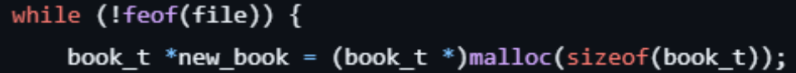
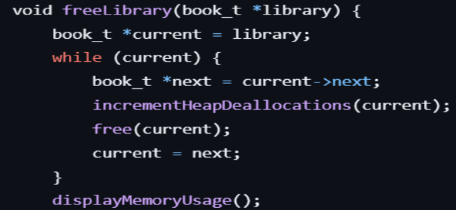
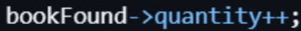
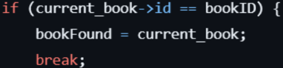
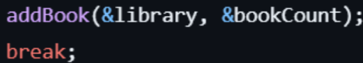
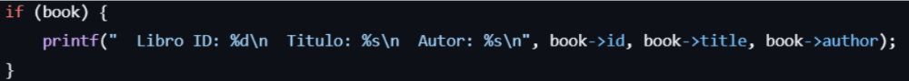
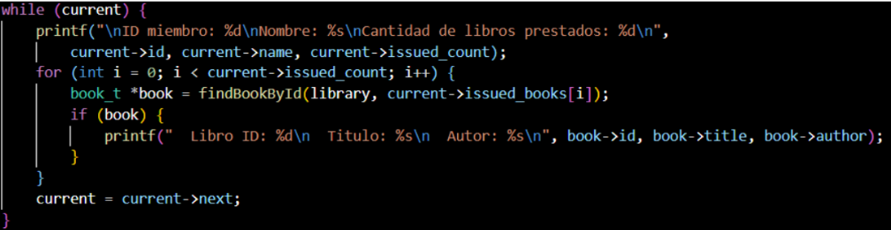
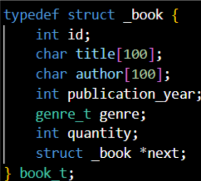

+++
date = '2025-02-21T10:19:37-08:00'
draft = false
title = 'Practica1'
Summary = 'Mario Navarro'
+++

## Practica 1

```
El objetivo de esta práctica es identificar los elementos fundamentales de los lenguajes de programación: nombres, marcos de activación, bloques de alcance, administración de memoria, expresiones, comandos, control de secuencia como lo es; selección, iteración y recursión, subprogramas, y tipos de datos.
```

_Identificar estos conceptos en la aplicación propuesta para esta práctica._

Código

**Nombres**

``Variables:``

_book_t *new_book;_
_member_t *new_member;_

``Funciones:``

_add_book()_,
_add_member()_,
_search_book()_,
_search_member()_.

``Estructuras de Datos:``

_book_t_,
_member_t_

``Marcos de Activacion``
```
Cuando se llama a add_book(), se crea un marco de activación que contiene las variables
locales, como new_book, current_book, entre otras.
Lo mismo ocurre con las demás funciones como add_member(), search_book(), etc.
```
``Bloques de Alcance``
```
Un bloque de alcance define el área del código donde una variable o función es accesible. El alcance de una variable puede ser local o global.

Dentro de la función add_book(), la variable new_book es local a esa función. Lo mismo sucede con las variables como new_member en la función add_member(). Las variables globales (por ejemplo, las listas que almacenan los miembros y los libros) tienen un alcance en todo el programa.
```
```Administración de Memoria```
```
La administración de memoria se refiere a cómo el programa asigna y libera espacio en memoria para las variables.
```


``Expresiones``
```
Las **expresiones** son combinaciones de variables, operadores y valores que se evalúan para producir un resultado.
```
Expresiones de asignación



Expresiones condicionales



Expresiones aritméticas


``Comandos``
```
Los comandos son instrucciones que el programa ejecuta. En tu código, los comandos incluyen la asignación, las llamadas a funciones, las declaraciones
```

```
Se llama a la función addbook para agregar un libro.
```
```Control de Secuencia: Selección, Iteración, y Recursión```

**Selección** (estructuras condicionales): El flujo del programa se dirige según una condición.



```Iteración (bucles):``` El flujo del programa se repite varias veces.



```Recursión:``` No hay funciones recursivas en el programa.

```Un subprograma:``` es un bloque de código que realiza una tarea específica.
add_book()
add_member()
search_book()
search_member()

```Tipos de Datos```
```
Tenemos los tipos de datos primitivos int, char, float y los complejos como las estructuras
```

```
las cuales permiten almacenar distintos tipos de datos bajo un nombre
```