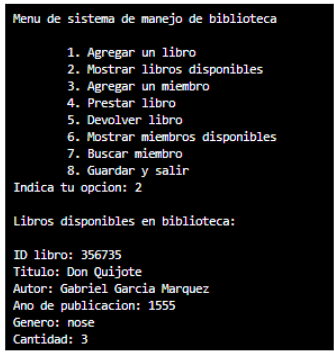

+++
date = '2025-02-21T10:19:41-08:00'
draft = false
title = 'Practica2'
Summary = 'Mario Navarro'
+++


# Explicación del Funcionamiento del Programa de Biblioteca

## Objetivo de la práctica
El propósito de esta práctica es proporcionar una explicación detallada del funcionamiento del programa desarrollado.

## Estructura del Proyecto

- `env/`: Contiene un entorno virtual de Python para asegurar la consistencia de las dependencias.
- `src/`: Directorio del código fuente principal.
- `__pycache__/`: Archivos compilados en bytecode para acelerar futuras ejecuciones.
- `static/`: Archivos estáticos como CSS, JS e imágenes.
- `templates/`: Plantillas HTML para generar páginas dinámicas.
- `biblioteca_web.py`: Servidor web con Flask para interactuar con la biblioteca.
- `biblioteca.py`: Contiene la lógica principal del sistema.
- `memory_management.py`: Módulo para el monitoreo del uso de memoria.
- `Makefile.txt`: Automatiza tareas comunes del proyecto.
- `requirements.txt`: Lista de dependencias del proyecto.

## Detalles del Funcionamiento

### biblioteca_web.py
```python
from flask import Flask, request, jsonify, render_template
from memory_management import memory_management
from biblioteca import Book, DigitalBook, Member, Library, Genre
```
- Usa Flask y módulos personalizados para manejar libros y miembros.
```python
@app.route('/books', methods=['POST'])
def add_book():
    '''Agregar un libro a la biblioteca'''
    data = request.json
    is_digital = data.get('is_digital', False)
    if is_digital:
        book = DigitalBook(
            int(data['id']), data['title'], data['author'], data['publication_year'],
            data['genre'], data['quantity'], data['file_format']
        )
    else:
        book = Book(
            int(data['id']), data['title'], data['author'], int(data['publication_year']),
            data['genre'], int(data['quantity'])
        )
    library.add_book(book)
    # Guardar datos después de agregar un libro
    library.save_library_to_file("library.json")
    memory_management.display_memory_usage()
    return jsonify(book.to_dict()), 201
```
- Define rutas para mostrar, agregar, prestar y devolver libros.
```python
# Cargar datos al iniciar la aplicación
library.load_library_from_file("library.json")
library.load_members_from_file("members.json")
```
- Administra carga y guardado de datos desde archivos JSON.
```python
@app.route('/load', methods=['POST'])
def load():
    '''Cargar los datos de la biblioteca desde un archivo.'''
    library.load_library_from_file("library.json")
    library.load_members_from_file("members.json")
    memory_management.display_memory_usage()
    return jsonify({"message": "Datos cargados exitosamente!"})

```
- Ofrece una API básica para interactuar vía web.

### biblioteca.py
```python
class Genre:
    '''Clase para definir los generos de los libros'''
    FICTION = "Ficcion"
    NON_FICTION = "No Ficcion"
    SCIENCE = "Ciencia"
    HISTORY = "Historia"
    FANTASY = "Fantasia"
    BIOGRAPHY = "Biografia"
    OTHER = "Otro"
```
- Incluye clases: `Genre`, `Book`, `DigitalBook`, `Member`, `Library`.

```python
    def __del__(self):
        memory_management.increment_heap_deallocations(1)
```

- Las clases `Book` y `Member` registran el uso de memoria.
```python
    def to_dict(self):
        '''Método para convertir los datos del miembro en un diccionario'''
        return {
            "id": self.id,
            "name": self.name,
            "issued_books": self.issued_books
        }

    @staticmethod
    def from_dict(data):
        '''Método para crear un objeto miembro a partir de un diccionario'''
        member = Member(int(data["id"]), data["name"])
        member.issued_books = data["issued_books"]
        return member
```
- Métodos para convertir objetos a y del formato diccionario.
```python
class Library:
    '''Clase para definir la biblioteca'''
    def __init__(self):
        '''Constructor de la clase Library'''
        self.books = []
        self.members = []
        memory_management.increment_heap_allocations(1)

    def __del__(self):
        memory_management.increment_heap_deallocations(1)

    def add_book(self, book):
        '''Método para agregar un libro a la biblioteca'''
        self.books.append(book)
        print("\nEl libro fue agregado exitosamente!\n")
        memory_management.display_memory_usage()

    def find_book_by_id(self, book_id):
        '''Método para buscar un libro por su ID'''
        for book in self.books:
            if book.id == book_id:
                return book
        return None

    def display_books(self):
        '''Método para mostrar los libros disponibles en la biblioteca'''
        if not self.books:
            print("\nNo hay libros disponibles.\n")
            return
        print("\nLibros disponibles en biblioteca:\n")
        for book in self.books:
            print(f"ID libro: {book.id}\nTitulo: {book.title}\nAutor: {book.author}\nAno de publicacion: {book.publication_year}\nGenero: {book.genre}\nCantidad: {book.quantity}\n")
            if isinstance(book, DigitalBook):
                print(f"Formato de archivo: {book.file_format}\n")
        memory_management.display_memory_usage()

```
- La clase `Library` gestiona operaciones generales.

### memory_management.py

```python
class MemoryManagement:
    '''Class to manage memory usage'''
    def __init__(self):
        self.heap_allocations = 0
        self.heap_deallocations = 0

    def increment_heap_allocations(self, size):
        '''Increment heap allocations'''
        self.heap_allocations += size

    def increment_heap_deallocations(self, size):
        '''Increment heap deallocations	'''
        self.heap_deallocations += size

    def display_memory_usage(self):
        '''Display memory usage'''
        print(f"Heap allocations: {self.heap_allocations} bytes")
        print(f"Heap deallocations: {self.heap_deallocations} bytes")


memory_management = MemoryManagement()
```

- Define la clase `MemoryManagement` para contar asignaciones y liberaciones de memoria.
- Métodos para mostrar estadísticas en consola.
- Instancia global accesible desde otros módulos.

## Funcionamiento General del Programa

1. Se ingresan los datos del libro (ID, título, autor, etc.).
2. Se muestran los datos del libro añadido.
3. Se registran nuevos miembros con su nombre e ID.
4. Para prestar un libro se ingresan los ID de miembro y libro.
5. Se imprime información de depuración y confirmación del préstamo.
6. Para devolver el libro, se repite el proceso con los mismos ID.
7. El sistema permite visualizar la información del miembro.
8. Los datos se guardan en archivos JSON.

