+++
date = '2025-02-21T10:19:46-08:00'
draft = false
title = 'Practica3'
Summary = 'Haskell'
+++

### Primer sesion:
 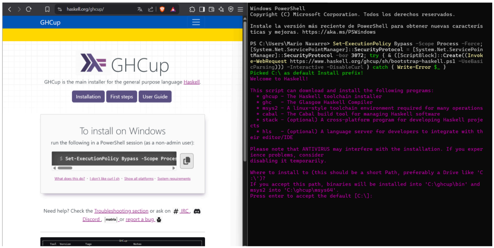
 
 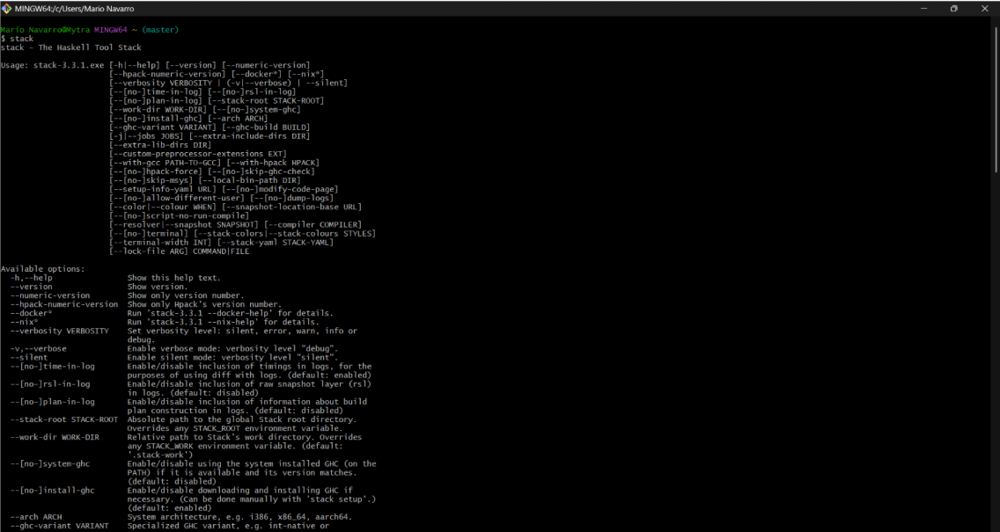
Ejecutamos el comando stack el cual nos mostrará una lista de comandos.

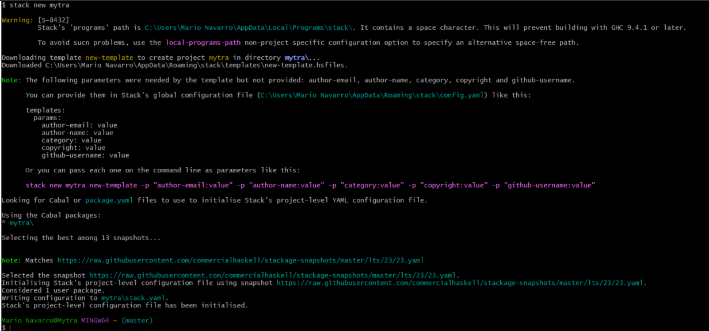

Utilizamos el comando $stack new para configurar el entorno de desarrollo de Haskell con Stack.

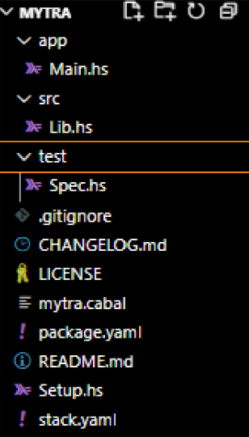

El comando Stack nos crea varios archivos

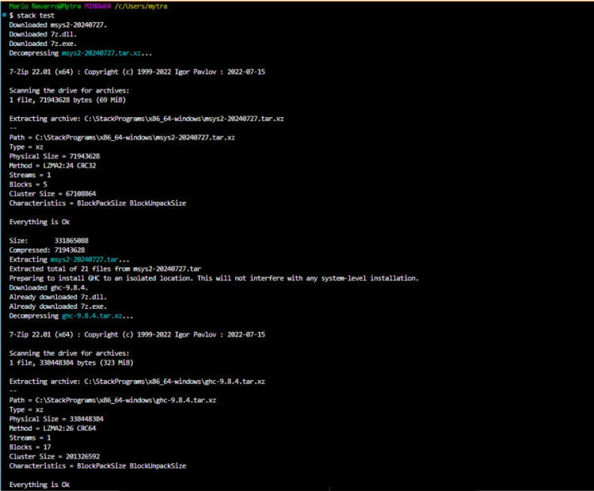

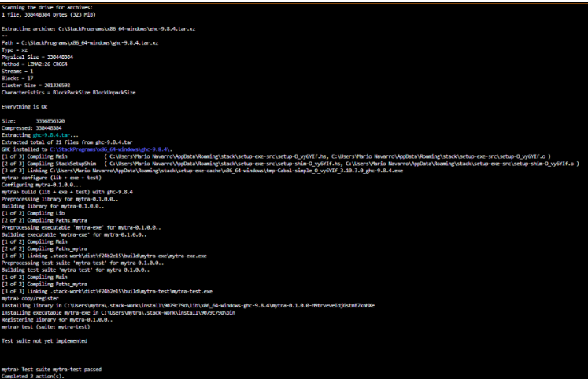

Con stack test veremos que nuestro proyecto de Haskell se compiló bien y va sin problemas. Haskell Stack está funcionando correctamente en el sistema y ahora se puede construir el proyecto.

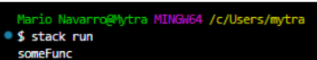

Nuestro proyecto está listo para ser configurado.

### Segunda sesión:

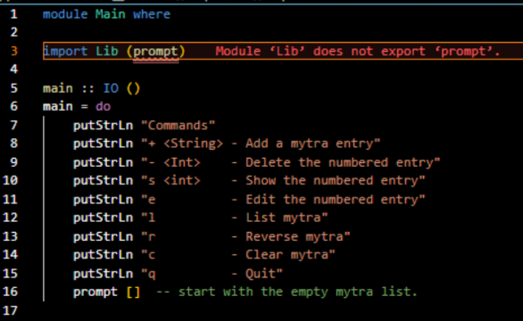

vemos que el main nos muestra los comandos que se pueden utilizar para la aplicación.

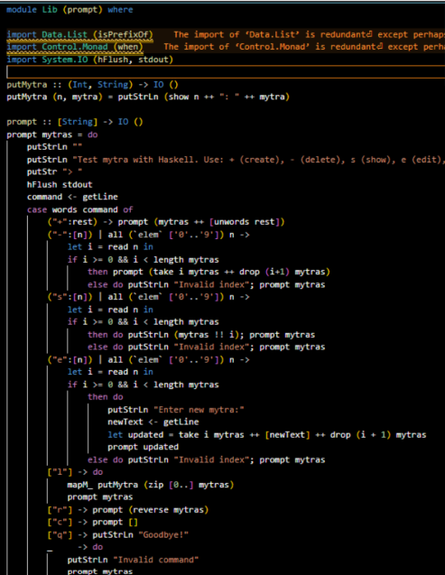

La lógica principal de la aplicación se maneja con prompt y la importamos desde el archivo Lib.hs que editamos de la anterior manera.

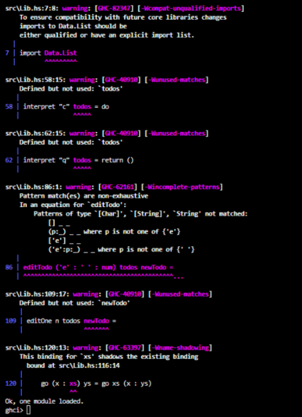

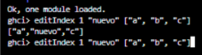

Utilizamos el comando stack repl para comprobar las funciones en ghci

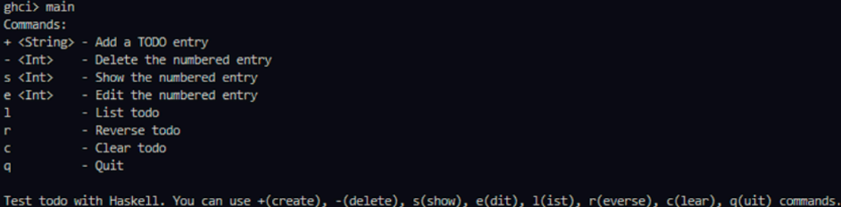

Ya podemos comprobar cada función de la aplicación

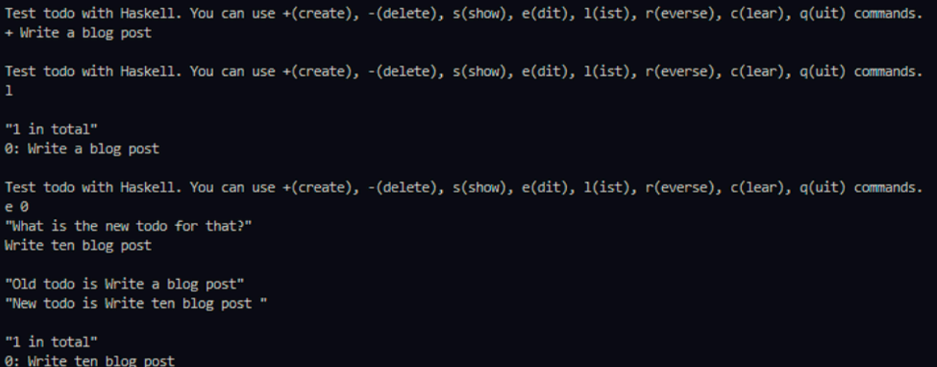

comenzando con el comando de “+” para incluir una tarea pendiente, posteriormente “l” para saber si está guardada en nuestra lista de tareas y por último “e 0” para editar.

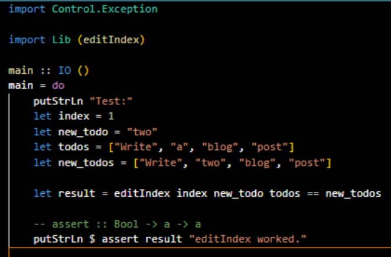

Actualizamos la prueba/Spec.hs de la anterior manera.

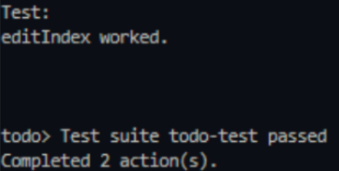

Con este comando nuevamente vemos como Stack completó las dos acciones necesarias de compilar el proyecto y ejecutar la suite de pruebas.

**Explicación**

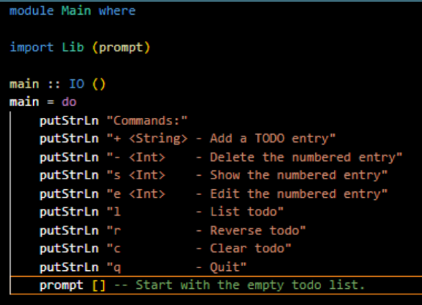

**_app/Main.hs:_** 
Punto de Entrada Principal Este archivo representa el punto de entrada principal de la aplicación de lista de tareas. Es ejecutado al correr stack run. Inicio de la aplicación: Muestra al usuario una lista de comandos disponibles para interactuar con la aplicación. Bucle interactivo: Llama a la función prompt con una lista de tareas vacía ([]), iniciando así el ciclo de interacción continua con el usuario.

**_Lib.hs:_** Lógica Principal de la Aplicación

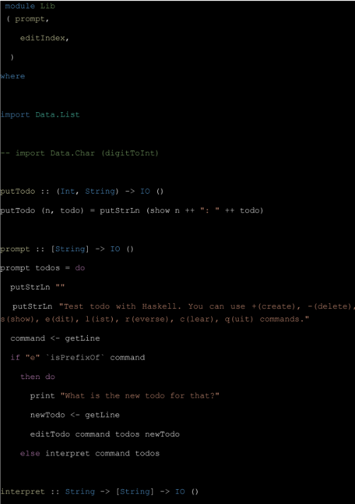
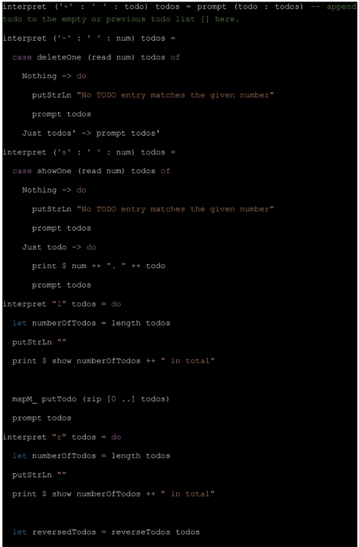
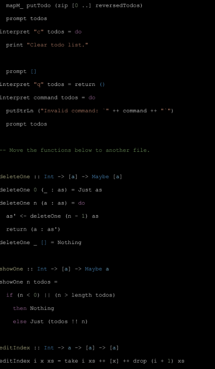
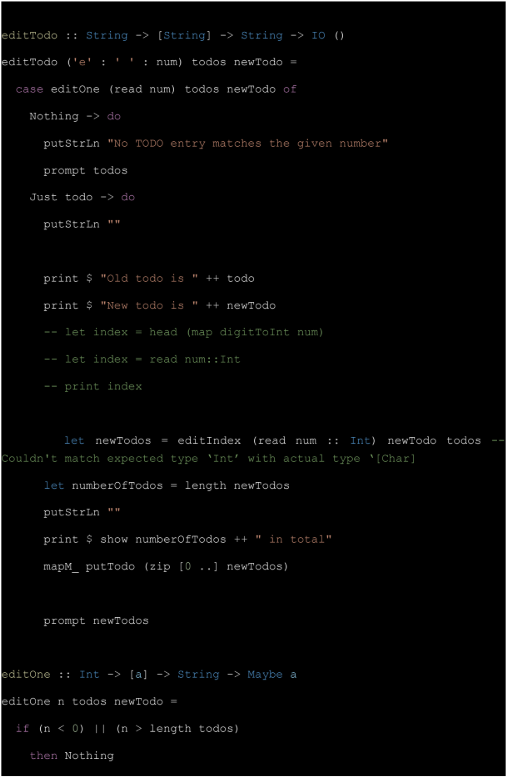
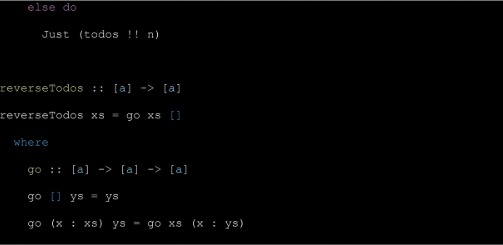

```
Este módulo contiene la funcionalidad principal de la aplicación. Se divide en dos partes clave:

Funciones de Interfaz de Usuario (con efectos IO) Estas funciones trabajan directamente con el usuario mediante entrada y salida estándar: 

putTodo: Muestra una tarea. 

prompt: Bucle interactivo que gestiona la entrada del usuario. 

interpret: Interpreta comandos del usuario y actualiza la lista de tareas.

editTodo: Permite editar una tarea específica. Funciones Puras (sin efectos secundarios) Estas funciones manipulan listas de manera funcional, sin 

interacción con el exterior: deleteOne: Elimina una tarea por índice. 

showOne: Devuelve una tarea específica. editIndex: Reemplaza una tarea en un índice determinado. editOne: Valida y devuelve una tarea para su edición.

reverseTodos: Invierte el orden de las tareas.
```

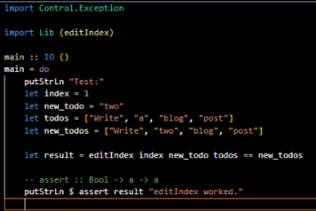

**Flujo de Ejecución de la Aplicación** 
```
Al ejecutar stack run: Compilación y ejecución: 

Stack compila el proyecto y ejecuta la función main en Main.hs. Impresión de comandos: Se muestra al usuario una lista de comandos disponibles:

+ <texto> → Añadir tarea

- <numero> → Eliminar tarea

s <número> → Mostrar tarea

e <número> → Editar tarea 

l → Listar todas las tareas 

r → Invertir el orden de las tareas 

c → Limpiar la lista de tareas 

q → Salir de la aplicación 

Inicio del ciclo interactivo: Se llama a prompt [], que gestiona la interacción continua con el usuario, procesando entradas y actualizando la lista.
```
**_test/Spec.hs:_** Pruebas Unitarias Este archivo contiene pruebas automáticas para asegurar la calidad del código.